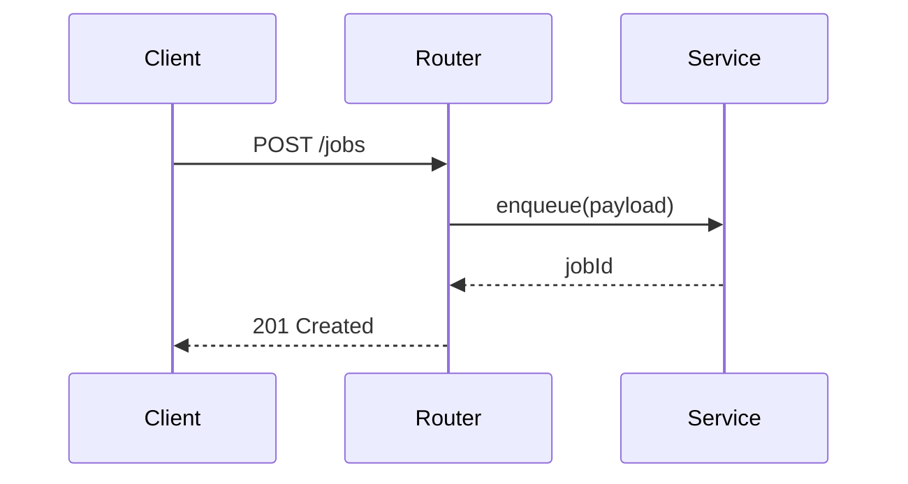

# Wiki Conventions Reference

Detailed conventions for `openwiki/` pages. The SKILL.md covers workflow; this
covers format and content rules.

## OKF Frontmatter

Every non-reserved markdown file under `openwiki/` must begin with OKF v0.1
YAML frontmatter. `quickstart.md` and `index.md` are reserved and do not need it.

### Shape

```yaml
---
type: <Type name>                  # REQUIRED — free-form concept kind
title: <Optional display name>
description: <Optional 1-2 sentence summary, optimized for search>
resource: <Optional canonical URI for the underlying asset>
tags: [<tag>, <tag>]              # Optional
timestamp: <Optional ISO 8601 datetime>
---
```

### Rules

- **`type` is the only required field.** Choose a descriptive, self-explanatory
  concept kind: `Service`, `API Endpoint`, `Component`, `Module`, `Workflow`,
  `Data Model`, `Playbook`, `Reference`, etc. Values are not centrally registered.
- **`title`** — human-readable display name.
- **`description`** — 1-2 sentences optimized for retrieval. Clear and detailed.
- **`resource`** — canonical URI of the underlying asset when one exists.
- **`tags`** — short cross-cutting category strings.
- **`timestamp`** — ISO 8601 of the last meaningful change.
- Produce valid YAML. No placeholder text or explanatory comments in written files.
- Preserve existing producer-defined fields when updating. Unknown fields are valid.

### OpenWiki extension (optional)

When source evidence supports it, add an `openwiki:` block for routing metadata:

```yaml
openwiki:
  roles: [architecture, domain]          # one or more of the role values below
  change_kinds: [lifecycle, public-api]  # short kebab-case facets
  source_paths: [path/to/canonical-source.ts]
  symbols: [PublicSymbol, owningInternalSymbol]
  test_paths: [path/to/focused.test.ts]
  invariants: [A concise externally observable contract.]
  validation_commands: [the narrowest non-destructive check]
```

**Roles:** `architecture`, `delivery`, `domain`, `integration`, `operations`,
`repository`, `testing`, `workflow`.

Omit empty keys. Never place secrets in metadata. Treat `source_paths`,
`test_paths`, `invariants`, and `validation_commands` as evidence-backed
routing hints, not exhaustive requirements.

## Page Structure

A substantive page should cover (adapt to the concept type):

1. **What it does** — the system's responsibility, in plain language.
2. **Why it exists** — the problem it solves, the design intent.
3. **Ownership and entrypoints** — the owning source files, main entry symbols.
4. **Important symbols** — public types, key functions, exported APIs.
5. **Dependencies and data flow** — what it calls, what calls it, data lifecycle.
6. **Invariants and lifecycle ordering** — externally observable contracts.
7. **Extension points** — where/how to add behavior.
8. **Focused tests** — which tests prove the behavior (describe by invariant, not
   just file name).
9. **Validation** — the narrowest command to check this area.
10. **Scope boundaries** — generated files, broader checks, what's out of scope.

Not every page needs all sections. Match sections to the concept type.

## Concision Principles

- **Concise = dense and non-redundant, not short.** Do not omit important
  domains, components, or relationships.
- **One canonical home per concept.** Link from other pages instead of duplicating.
- **No manufactured links or thin pages.** Link only where a relationship exists.
- **Path compression:** shorten the route from engineering intent to owning files,
  symbols, related systems, tests, and validation commands.
- Each substantive concept should connect to at least two other concepts when
  evidence supports it. An isolated page is acceptable only if genuinely standalone.

## Markdown Links as Relationships

Treat markdown links between concept pages as semantic relationship edges. Put a
link in the prose sentence that explains the relationship:

- Good: "The job runner `dispatches to` the queue adapter ([queue/adapter](../queue/adapter.md))."
- Bad: a bare "See also: [adapter](../queue/adapter.md)" at the bottom.

State the relationship meaning in surrounding prose: `depends on`, `dispatches
to`, `shares infrastructure with`, `is configured through`, `is surfaced by`,
`is secured by`. Add reciprocal links only when they help explain the target.

## Diagrams

Add grounded Mermaid diagrams for significant runtime flows, call sequences,
lifecycles/state machines, and data models.

### When to diagram

- Request/runtime flows → `sequenceDiagram`
- Lifecycles/state machines → `stateDiagram-v2`
- Data models → `erDiagram`
- Branching control flow → `flowchart`

Skip diagrams on navigation, reference tables, or configuration pages. Prefer a
few substantive diagrams over decorating every page.

### Grounding rules

- Every participant, state, entity, and relationship must come from inspected source.
- Do not invent nodes the code does not support.
- Give each diagram a one-line caption.
- A stale diagram is a stale claim: fix it in the same edit as surrounding prose.

```markdown

```

## Source References

- Prefer stable paths and symbol names over line numbers.
- Inline source references: `routes/jobs.ts:createJob` or `see routes/jobs.ts`.
- Optional Source Map section at page bottom if it materially improves navigation.
- For short pages, inline references are cleaner than a Source Map.

## Test References

- Describe tests by the behavior and invariant they exercise, not just the file.
- "marksRetryExhaustionFailed in tests/job-lifecycle.test.ts proves the terminal
  retry path" — not just "see job-lifecycle.test.ts".
- When a test file is large, identify the relevant `describe`/`it` suite or stable
  test name so a future `Grep` scoped to `tests/` reaches the right section.

## Validation Commands

- Keep commands narrow and quiet by default.
- Identify flags or focused commands that suppress successful output while
  preserving complete failure diagnostics.
- Separate ordinary focused checks from expensive integration/release/perf checks.
  Label expensive checks as conditional and state when they're necessary.
- Do not encourage broad validation (e.g. full test suite) by default.

## Required Documentation Structure

```
openwiki/
├── quickstart.md          # Entrypoint: overview + links + task-routing table
├── .last-update.json      # Last-documented commit metadata
├── INSTRUCTIONS.md        # User-authored brief (read-only during runs)
├── architecture/          # System-level design, decisions
│   └── overview.md
├── domain/                # Business logic, data models
│   └── *.md
├── api/                   # API endpoints, public surfaces
│   └── *.md
├── workflows/             # Cross-system flows, lifecycles
│   └── *.md
└── ...                    # Other sections that fit the repo
```

Section directory names should fit the repository's actual components and
domains: `architecture/`, `workflows/`, `domain/`, `api/`, `data-models/`,
`operations/`, `integrations/`, `testing/`, etc.

### quickstart.md requirements

- High-level overview of what the wiki covers.
- Links to every major section.
- **Task-routing table** with columns: change area / intent → wiki page → source
  entrypoints → symbols/types → focused tests → minimal validation command.
- `## Backlog` section for deferred areas (each with source anchor + reason).

## Section Quality Rules

- Do not create a directory unless it represents a real documentation area.
- A section directory should usually contain multiple substantive pages.
- Each page must provide real explanatory value: what, why, where to start, what
  to watch out for, key source references.
- Before finishing, review the tree and remove low-value stubs while preserving
  coverage of independent components.

## last-update.json Format

```json
{
  "updatedAt": "2026-08-06T12:00:00.000Z",
  "command": "init|update",
  "gitHead": "abc1234...",
  "model": "claude",
  "status": "complete|interrupted"
}
```

This file lets future updates diff from the last-documented commit. Write it
after every successful init/update. Interrupted runs record `status:
"interrupted"` so the next update knows the wiki may be partial.
