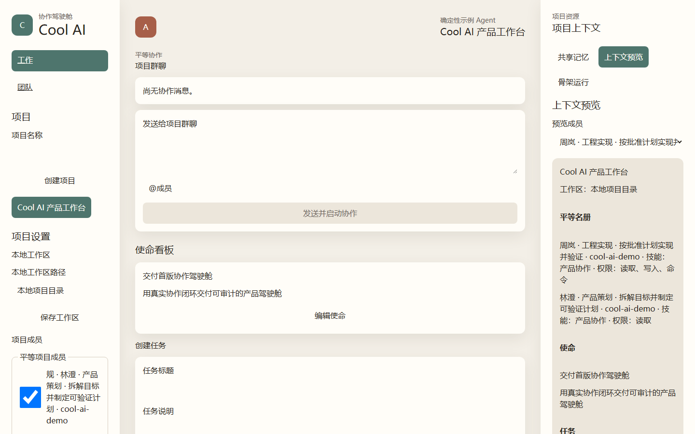
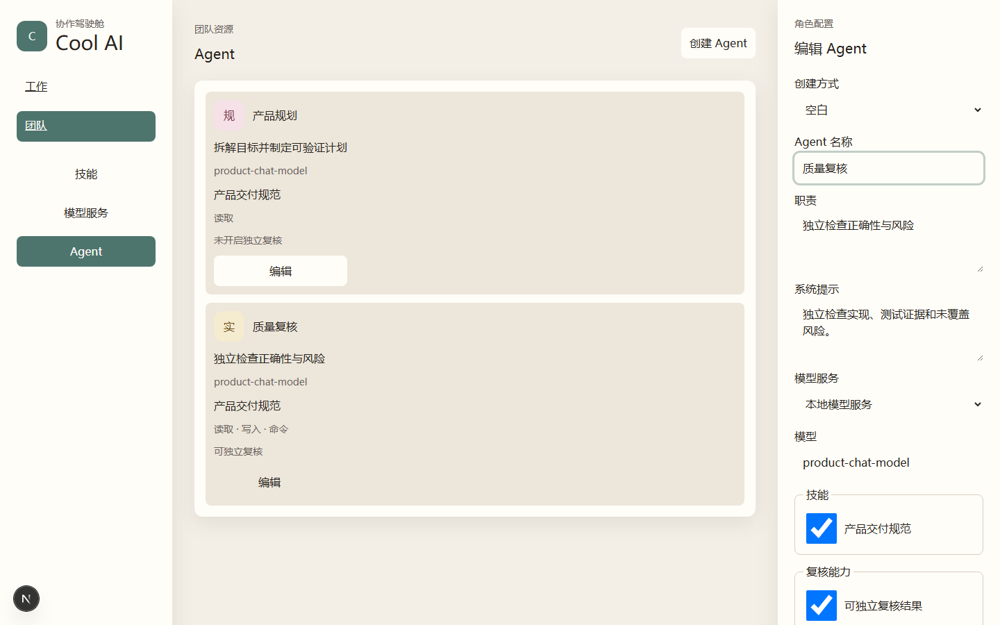
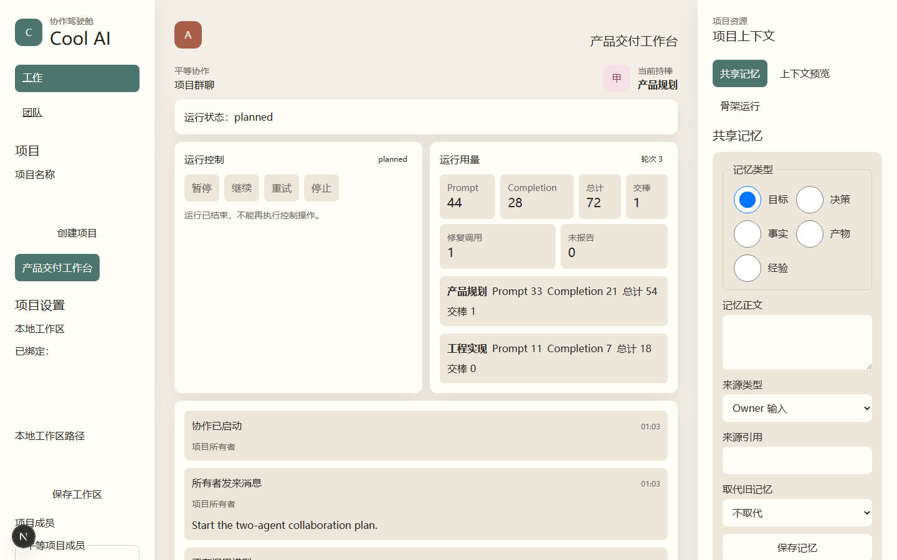
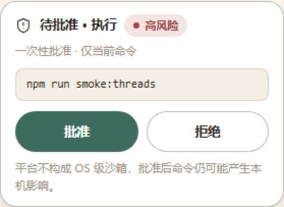
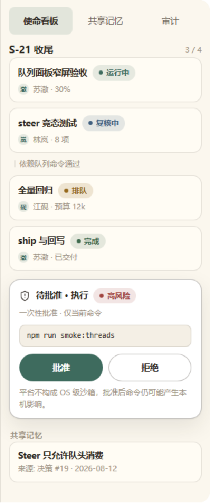

# Cool AI

A local-first collaboration cockpit where one product owner assembles configurable Agents into a peer team that can coordinate, execute, review, remember, and deliver.

**English** · [简体中文](./README.zh-CN.md)

## Why Cool AI?

Building with multiple Agents often turns the owner into a human router: copying context, assigning the next step, reconciling scattered outputs, and checking whether anyone actually verified the result. Cool AI keeps the owner in control without making them relay every message. The team works from one mission board, shared memory, visible handoffs, bounded execution, and an auditable delivery trail.



## What it does

- **Configurable teams:** connect an OpenAI-compatible Provider, create reusable text skills, and define distinct Agents with their own roles, models, permissions, and budgets.
- **Shared project context:** bind a local workspace, form a peer team, and manage a mission DAG with owners, dependencies, status, and source-linked memory.
- **Real collaboration:** Agents use structured Provider calls to propose and claim work, talk in the project room, hand off explicitly, ask the owner for decisions, and resume from persisted state.
- **Safe two-lane execution:** run at most two independent tasks per project in isolated staging areas, with verified paths, exact command approval, resource limits, validation, stale/conflict checks, and controlled merge.
- **Independent review:** the owner selects an eligible non-executing Agent to review a frozen result and return `reject`, `escalate`, or `pass`; the platform cannot invent a verdict.
- **Memory and delivery:** preserve source-linked goals, decisions, facts, artifacts, and lessons in immutable version chains, then generate the final delivery after every task passes review.

## From Provider to delivery

1. Add and verify a Provider, then create skills and at least two distinct Agents.
2. Create a project, bind its local workspace, and add the Agents as equal members.
3. Define a mission and its task DAG; submit the goal in the project conversation.
4. Let Agents propose, claim, discuss, and hand off work while the owner can speak, mention an Agent, answer a decision request, pause, or redirect.
5. Start execution only for dependency-ready tasks. Each execution works in an isolated area and exposes file actions, command approvals, validation, and staged changes before merge.
6. Select a qualified non-executing Agent to review each current result. Resolve rejection or escalation, preserve accepted memory, and generate the final delivery when all tasks pass.

<details>
<summary>See team configuration</summary>


</details>

<details>
<summary>See real Agent collaboration</summary>


</details>

<details>
<summary>See safe execution</summary>


</details>

<details>
<summary>See review and delivery</summary>


</details>

## Platform and security boundaries

Cool AI is a **local-first, single-owner application with no authentication**. Use it only on a trusted machine and do not expose the development server or APIs to an untrusted network. Model requests and the context needed for a task are sent to the Provider configured by the owner, so local-first does not mean fully offline.

- **Web, configuration, and collaboration:** designed for a local desktop browser. Running these surfaces on a platform does not establish verified file-execution support.
- **Full verified execution:** supported only on Windows 10+ or Windows Server 2016+ x64, with x64 Node.js and local NTFS/ReFS volumes. File execution on other operating systems, architectures, or file systems fails closed with `SANDBOX_UNVERIFIABLE`.
- **Guardrail, not an OS sandbox:** isolation, verified handles, permissions, approvals, limits, validation, and conflict checks reduce accidental damage. An owner-approved local executable may still access the network, system resources, processes, services, files, or credentials. Use a VM, container, or OS policy for hostile code.
- **Provider contract:** compatibility is limited to `GET /models` and `POST /chat/completions`; chat content must be a JSON object and usage must be valid, non-negative, and arithmetically consistent.
- **Lifecycle:** each project allows at most two active executions, and each Agent at most one. There is no background worker; closing the browser or restarting the app does not continue or replay unattended work.

Read [Security](./docs/security.md), [Platforms and limits](./docs/limits-and-platforms.md), and [Provider compatibility](./docs/provider-compatibility.md) before enabling execution.

## Quick start

Requirements: Node.js 24.x and npm 11.x.

```powershell
npm install
# For a clean lockfile-based install, use: npm ci
```

Generate a fresh 32-byte base64url master key. Never commit it.

PowerShell:

```powershell
$env:COCKPIT_MASTER_KEY = node -e 'const { randomBytes } = require("node:crypto"); process.stdout.write(randomBytes(32).toString("base64url"))'
```

POSIX shell:

```sh
export COCKPIT_MASTER_KEY="$(node -e 'const { randomBytes } = require("node:crypto"); process.stdout.write(randomBytes(32).toString("base64url"))')"
```

Start the application:

```powershell
npm run dev
```

Open <http://localhost:3000>. Losing or changing `COCKPIT_MASTER_KEY` makes previously saved Provider credentials undecryptable; replace those credentials in Team settings.

## Environment variables

- `COCKPIT_MASTER_KEY` — required to save or use Provider credentials; a canonical base64url encoding of 32 random bytes. Keep it separate from the database and source tree.
- `COCKPIT_DB_PATH` — optional SQLite path; defaults to `.data/cockpit.sqlite`.
- `COCKPIT_EXECUTION_ROOT` — optional execution sandbox and recovery root; defaults to `.data/executions`. Do not place it inside a project workspace.

See [Configuration](./docs/configuration.md) for path examples, backup requirements, and recovery implications.

## Architecture at a glance

The React 19 cockpit calls Next.js 16 App Router handlers. Route handlers parse and validate DTOs before calling server-side domain services for projects, collaboration, execution, review, memory, and delivery; security-critical mutations such as execution and review also apply an explicit request-body cap. SQLite (`node:sqlite`) stores persistent facts and immutable versions; the Provider supplies model calls; workspace adapters isolate and verify file/process operations. The browser never accesses SQLite, Provider credentials, or host files directly.

```text
React cockpit → Next.js route handlers → domain services → SQLite
                                           ├────────────→ owner Provider
                                           └────────────→ workspace / execution sandbox
```

For the three main collaboration, execution, and review chains, see the [architecture overview](./docs/architecture/overview.md).

## Documentation

- [Documentation map](./docs/README.md)
- [Getting started](./docs/getting-started.md)
- [Team setup](./docs/guides/team-setup.md)
- [Project workflow](./docs/guides/project-workflow.md)
- [Collaboration and handoff](./docs/guides/collaboration.md)
- [Safe execution](./docs/guides/safe-execution.md)
- [Review and delivery](./docs/guides/review-and-delivery.md)
- [Troubleshooting](./docs/troubleshooting.md)

## Testing

The repository exposes only these test, build, and browser smoke commands:

```text
npm test
npm run build
npm run smoke
npm run smoke:team
npm run smoke:context
npm run smoke:collaboration
npm run smoke:execution
npm run smoke:review
```

See [Testing and verification](./docs/testing.md) for what each command covers.

## Current limits

Cool AI does not currently provide multi-user accounts or authentication, public cloud hosting, production deployment tooling, mobile-first operation, native vendor APIs, local Agent CLI guarantees, arbitrary shell access, hostile-code containment, unattended schedules, or automatic cross-restart progress. Narrow screens support basic viewing, conversation, and approval; configuration and parallel execution remain desktop-first.
