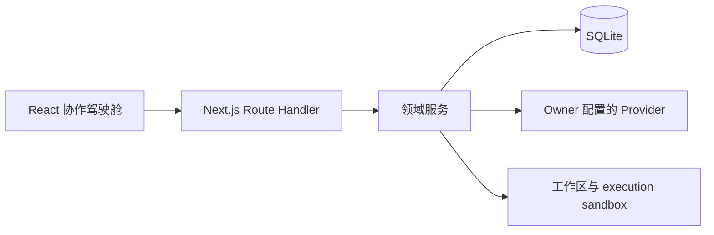

# 架构概览

本文描述当前实现结构，不建立另一套 Feature 或 ADR 真相源。产品边界以 [`product/`](../../product/) 为准；每个切片的需求、设计、评审与验收历史以 [`features/`](../../features/) 为准。

## 技术栈与边界

- React 19 负责协作驾驶舱 UI。
- Next.js 16 App Router 组织页面与 `app/api/**` Route Handler。
- Route Handler 解析并验证 DTO、调用领域服务并返回脱敏的稳定响应；execution、review 等安全关键 mutation 使用显式的 parse 前请求体上限。
- `src/server/**` 领域服务实现项目、协作、execution、复核、记忆和交付规则。
- SQLite（`node:sqlite`）保存单机持久事实、版本、lease、operation receipt 和事件。
- owner 配置的 OpenAI-compatible Provider 提供模型目录与结构化 chat completions。
- Windows native handle adapter 为当前支持平台提供 verified execution 文件边界；它不是 hostile OS sandbox。

UI 不直接访问 SQLite、Provider 凭据或宿主文件。Provider client 不接触数据库；领域编排器从凭据库取得调用所需密钥，并只持久化公开、脱敏、可审计结果。

## 三条主链

### collaboration：协作与接力

`群聊/控制 UI → collaboration Route Handler → run/turn orchestrator → OpenAI chat client → action committer → SQLite`

浏览器在项目打开时逐轮请求推进；服务端每次只提交一个原子业务 turn。严格 JSON object 经 schema 校验后，消息、任务动作、交棒、决策和 usage 在事务中落库。没有后台 worker，重启后只恢复持久状态，不自动重放 Provider 调用。

### execution：隔离执行与合并

`execution UI → execution Route Handler → execution/action service → sandbox/file/process adapters → stage/merge service → SQLite + canonical workspace`

任务和工作区基线先冻结，再在独立 sandbox 中运行结构化文件/命令动作。验证、审批、manifest、冲突和 operation receipt 形成可恢复链；只有符合自动合入边界的文本变更进入 canonical workspace。Windows verified-handle adapter 不可用时文件执行失败关闭。

### review：独立复核、记忆与交付

`review UI → review Route Handler → review orchestrator → Provider → finalizer/memory committer → delivery service → SQLite`

owner 选择合格非执行者 Agent。编排器冻结公开材料并调用该 Agent 的 Provider；finalizer 将 `reject`、`escalate` 或 `pass` 原子投影到 review head、任务状态和记忆。所有任务通过后，delivery service 从当前不可变版本链确定性生成交付摘要和 manifest。

## 数据与版本原则

- 使命看板是任务 DAG 和状态的机器事实源。
- operation id、lease token、CAS/version 和事务用于处理重复请求、在途结果与并发冲突。
- result、review、memory、delivery 使用不可变版本链；历史对象不会被新结论覆盖。
- 公开时间线记录结构化事件、状态、工具结果与 usage，不保存模型隐藏思维链或原始 Provider body。
- Provider API key 由进程本地主密钥加密；SQLite 与主密钥必须分离保管。

安全与平台能力请结合[安全模型](../security.md)及[限制与平台](../limits-and-platforms.md)阅读。
