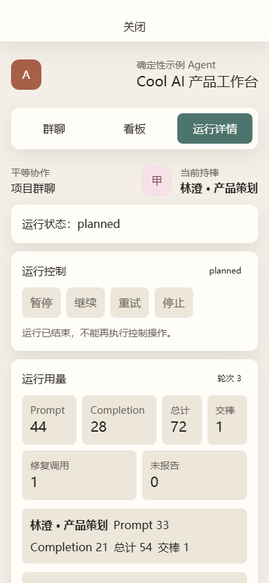

# 限制与平台

## 平台支持不是单一结论

基础 Web、Provider/技能/Agent 配置、项目上下文和协作界面与“完整 verified execution”是不同能力层。能启动 Next.js 页面或进行模型协作，不代表文件执行安全边界已在该平台验证。

完整 verified execution 当前只支持：

- Windows 10 或更高版本，或 Windows Server 2016 或更高版本；
- x64 操作系统与 x64 Node.js；
- NTFS 或 ReFS 本地卷；
- 可由应用安全读写的 canonical workspace 与 `COCKPIT_EXECUTION_ROOT`。

Linux、macOS、ARM、其他文件系统或 native verified-handle 能力不可用时，文件 execution 会失败关闭为 `SANDBOX_UNVERIFIABLE`，不会退回普通字符串路径检查。跨平台 verified execution 尚未实现。

## 调度与生命周期限制

- 每个项目最多两个 active execution。
- 同一任务同时最多一个 active execution。
- 同一 Agent 同时最多一个 active execution，且最多一个在途 execution 模型调用。
- 协作 turn 本身按单持棒者顺序提交；只有互不依赖的任务在 execution 层并行。
- 没有常驻后台 worker；浏览器关闭后不会继续自治推进。
- 应用刷新或重启会保留状态，但不会自动重放 Provider、命令或工具调用；owner 必须显式继续/重试。
- 不支持无人值守定时任务、跨重启自动运行、多节点调度或公开云托管。

active execution 包括 queued、running、waiting approval、paused 和 staged；stale、conflicted、failed、stopped、merged 不占并行名额，但 retry 仍沿用原 execution 历史与预算。

## 主要资源边界

- 协作运行：最多 50 个业务轮次；模型调用 90 秒超时，持久 lease 120 秒。
- Provider：验证 10 秒，模型响应 90 秒，响应最大 1 MiB。
- sandbox：最多 100,000 个目录项、2 GiB。
- execution：最多 20 个模型业务回合、40 次工具调用、15 分钟。
- 单命令：最多 120 秒；stdout/stderr 各保留最多 1 MiB。
- 文本工具：单次读/写最多 1 MiB；目录列举最多 1,000 项。
- 自动合入：最多 100 个 UTF-8 文本新增/修改，总最终内容最多 10 MiB。

边界命中时系统暂停、拒绝、截断并标记，或失败关闭；不会通过静默扩大上限继续运行。

## 明确不提供

- 多用户账号、认证、邀请和真人实时协作；
- 容器、虚拟机或 hostile OS sandbox；
- 任意 shell、任意可执行插件或技能市场；
- 厂商原生模型 API、流式响应或本地 Agent CLI 保证；
- 自动备份、主密钥轮换或恢复服务；
- 生产部署、桌面安装器和移动端完整操作体验。

窄屏提供查看、发言和审批所需的基础响应式界面，但复杂项目配置与并行执行仍以桌面浏览器为主要场景。

执行前请同时阅读[安全执行](./guides/safe-execution.md)和[安全模型](./security.md)。
